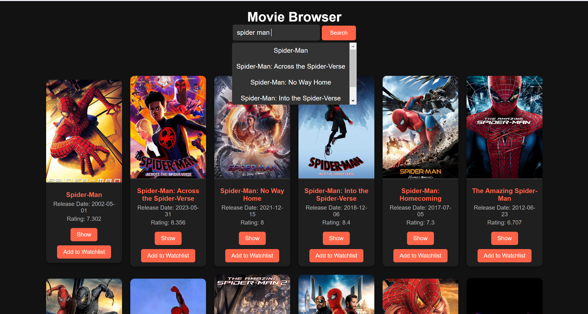
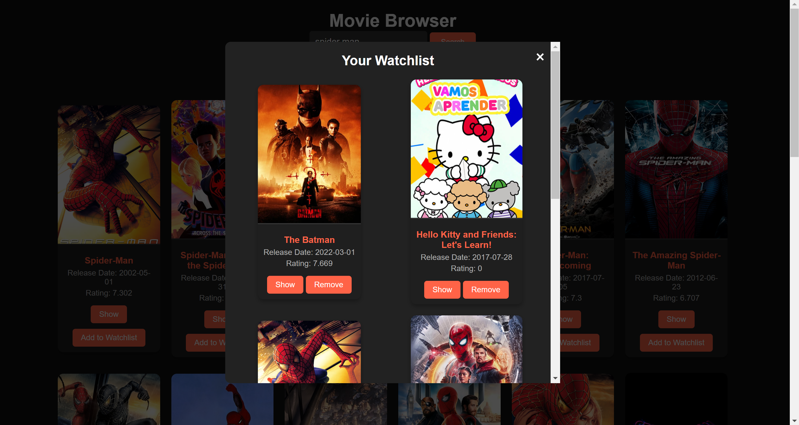
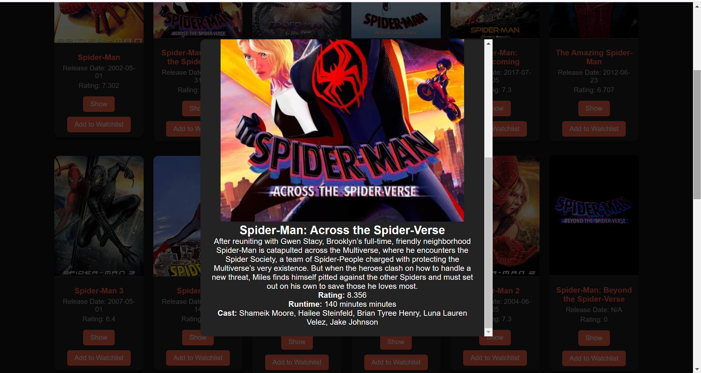
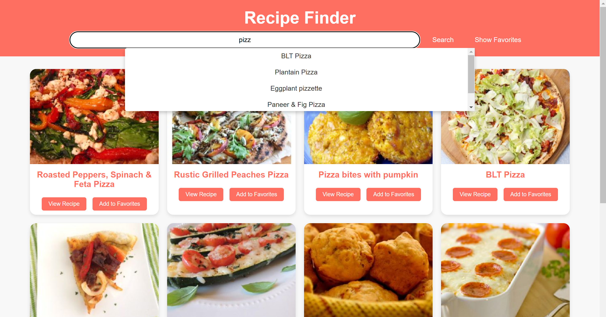
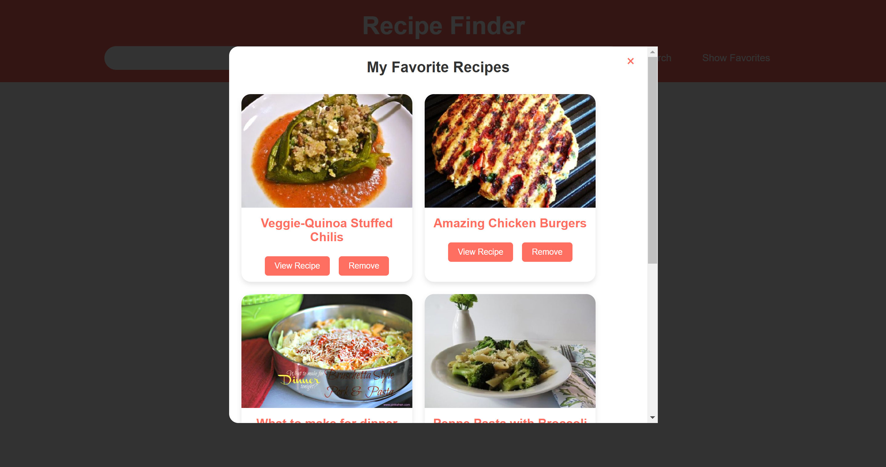
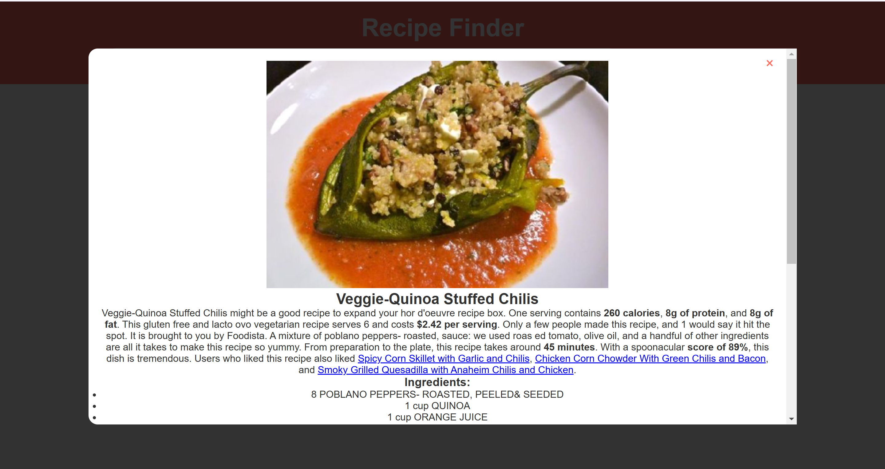
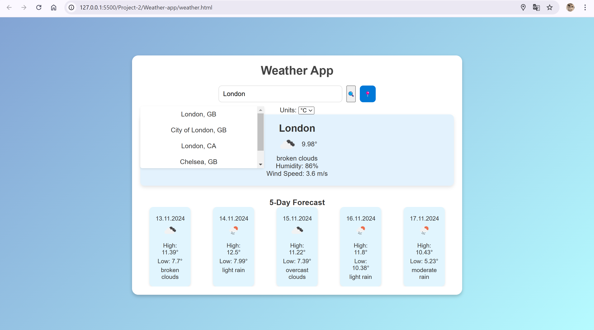
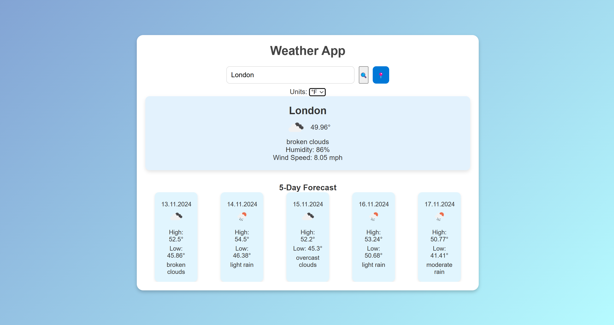
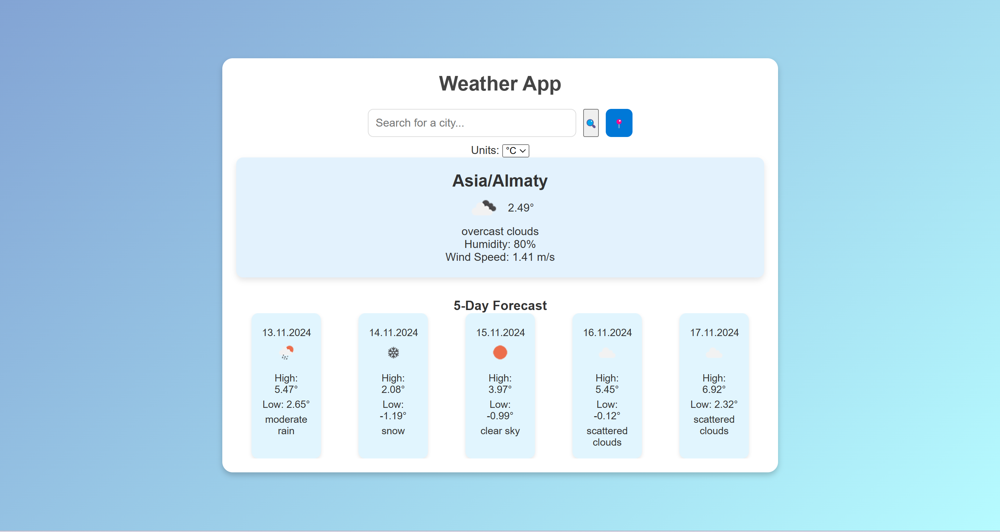

# Project 

This project includes three interactive web applications: a Movies App, a Recipe App, and a Weather App. Each app is designed with distinct functionalities to demonstrate API data fetching, user interaction through search and auto-suggestion, and local storage features.

---

## 1. Movies App

### Description
The Movies App allows users to search for movies, view detailed information about selected movies, and save favorites to a watchlist. The app utilizes The Movie Database (TMDb) API to retrieve information based on user queries.

### Features
- **Search Functionality**: Type a movie title to search, with auto-suggestions for relevant movies.
- **Movie Details Modal**: Select a movie to view its description, release date, rating, and cast.
- **Watchlist**: Save favorite movies to a watchlist, stored in local storage so it persists even after the page is reloaded.

### Instructions to Run
1. Replace `YOUR_API_KEY` in `movies.js` with your TMDb API key.
2. Open `movies.html` in a web browser.
3. Start searching for movies, view details, and add favorites to your watchlist.

### Screenshots

---

## 2. Recipe App

### Description
The Recipe App enables users to search for recipes by ingredient or dish name, view detailed recipe information, and save favorite recipes for easy access. It uses the Spoonacular API to display recipes along with ingredients, instructions, and nutritional information.

### Features
- **Search Functionality**: Search for recipes with auto-suggestions based on popular dishes.
- **Recipe Details Modal**: View ingredients, cooking instructions, and nutritional info for each recipe.
- **Favorites**: Add recipes to a favorites list, stored in local storage for easy access.

### Instructions to Run
1. Replace `YOUR_API_KEY` in `recipe.js` with your Spoonacular API key.
2. Open `recipe.html` in a web browser.
3. Use the search function to find recipes and add your favorites.

### Screenshots

---

## 3. Weather App

### Description
The Weather App provides real-time weather information and a 5-day forecast for a specified city or the user’s current location. It leverages the OpenWeatherMap API to retrieve weather data, based on user input or geolocation.

### Features
- **City Search**: Search for weather information by entering a city name, with suggestions appearing as you type.
- **Current Weather and 5-Day Forecast**: Displays temperature, humidity, wind speed, and a 5-day forecast.
- **Location-Based Weather**: Retrieve weather data based on the user’s current location if geolocation is enabled.
- **Unit Toggle**: Switch between Celsius and Fahrenheit for temperature.

### Instructions to Run
1. Replace `YOUR_API_KEY` in `weather.js` with your OpenWeatherMap API key.
2. Open `weather.html` in a web browser.
3. Search for weather by city or use the location button for automatic geolocation-based weather data.

### Screenshots

---

## General Instructions for Running the Applications
1. **Clone the Repository**: Clone this repository or download the HTML, CSS, and JavaScript files for each app.
2. **Add API Keys**: Ensure you have valid API keys from each respective service (TMDb, Spoonacular, OpenWeatherMap) and replace the placeholders in each JavaScript file.
3. **Run in Browser**: Open each HTML file (`movies.html`, `recipe.html`, `weather.html`) in your web browser to start using the applications.

Each application is self-contained and can be opened independently in any modern web browser without additional dependencies.

---

